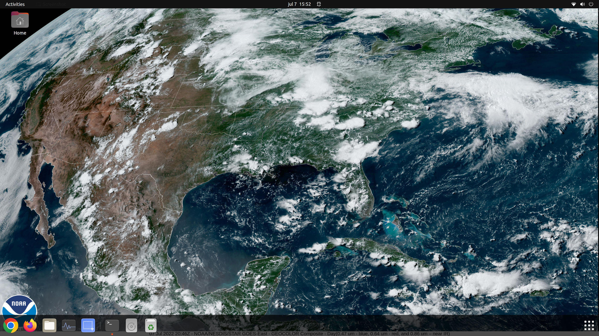
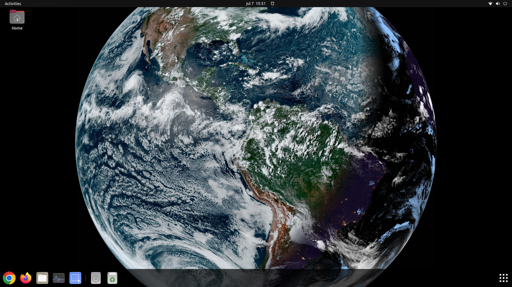

# Gnome Earth Wallpaper
This simple program let you set your background image to a live picture of the Earth!

Every 15 minutes the program automatically updates the background image with the most recent aveilable image of the earth.


## Instalation proccess
```
bash install.sh
```

## How to use it

This program has two available views:

* CONUS: Which stands for Contiguos United States
* Disk: The full view of the disk of the earth

### Change background image to the CONUS view of the Earth
```
earth-wallpaper set CONUS
```

Bellow you will see an example of how will look your background.
<p align="center">
    
</p>

<br>

### Change background image to the Disk view of the Earth

```
earth-wallpaper set DISK
```

<p align="center">
    
</p>

<br>
